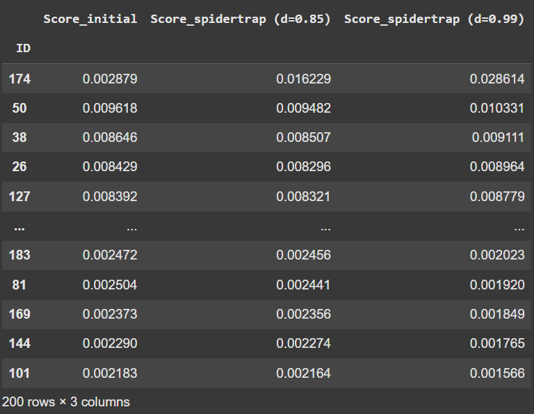

# Solution

This challenge is about PageRank, an algorithm for ranking webpages in search results. It measures the importance of each website based on the number and quality of incoming links. 


If you are unfamiliar with the concept, check out [this article](https://snap-stanford.github.io/cs224w-notes/network-methods/pagerank) or [this video](https://www.youtube.com/watch?v=rK2ZBmQHVVs&t=16s), as the rest of this writeup assumes you are aware of the algorithm and associated terminology (e.g. the random walker analogy).

We are provided with a 200x200 adjacency matrix (webpages.txt) and source code (src\.py). We are allowed a maximum of 5 modifications to the adjacency matrix to make _ropllc\.com_ the Most Important Website.

_Note: In this solution we will use 'ranking', 'importance' and 'PageRank score' interchangeably, but they all effectively mean the same thing._

### Identify _ropllc\.com_'s Index 
The adjacency matrix shows the links amongst all 200 websites. A '1' in the matrix at index (i,j) indicates that website i has a link pointing towards website j. The rows of the matrix are outlinks and the columns are inlinks.

We need to figure out which index represents _ropllc\.com_ so we can identify its inlinks and outlinks. Luckily for us, the server prints out the current rank of _ropllc\.com_.

```
Would you like to edit a link? (Y/N)n
RANKING FOR ropllc.com: 189
```

Copy parts of the source code to run PageRank on the matrix, then order the results.

```py
adjacency = np.loadtxt('webpages.txt', delimiter=",")
pagerank = PageRank()
scores = pagerank.fit_predict(adjacency)

# sort scores and find the index of rank 189 
# note that rank is 1-indexed but scores_sorted is 0-indexed
scores_sorted = sorted(zip(list(range(SIZE)), scores), key= lambda x: x[1], reverse=True)
targetidx = scores_sorted[188][0]
print('ropllc.com INDEX = {}'.format(targetidx))
```

We find that _ropllc.com_ is index **174**.

### Finding a Solution
The rest of the [solution script](./script.py) will reveal the following:

```
ropllc's OUTLINKS = [ 70 103 163]
ropllc's INLINKS = [  3 184 187]
Average INLINKS = 9.975
```

_ropllc\.com_ is one of the most lowly-ranked websites, and it has much fewer inlinks than the average site. Even with the ability to add 5 inlinks, _ropllc\.com_ will have a maximum of 8 inlinks, still less than average. 

Using PageRank theory, a site's importance is determined by the quality and quantity of inlinks. So, adding 5 inlinks from the 5 most important sites (50, 38, 113, 26, 127) to _ropllc\.com_ should increase its ranking. And it does improve, from #189 to #44, though not enough to be the highest ranked site. 

Instead, the easiest way to make it the highest rank site is to exploit one of the known problems with the PageRank algorithm... spider traps.


### Setting a Spider Trap
A spider trap occurs when outlinks from sites form a small group like this:

As soon as the random walker enters the loop, they are effectively stuck there. Hence, as the PageRank algorithm iterates, the sites within the loop will accumulate importance and all score very highly.


A spider trap can also be a singular site that **only** has 1 outlink pointing to itself (a 'self-loop'): 


We can exploit this and make _ropllc\.com_ a spider trap, so that it absorbs all the importance in the network. Simply remove all its outlinks and add 1 outlink pointing to itself. 

```
Would you like to edit a link? (Y/N)y
From: 174
To: 103
Success.

Would you like to edit a link? (Y/N)y
From: 174
To: 163
Success.

Would you like to edit a link? (Y/N)y
From: 174
To: 70
Success.

Would you like to edit a link? (Y/N)y
From: 174
To: 174
Success.

Would you like to edit a link? (Y/N)n
RANKING FOR ropllc.com: 1
LNC25{s377!n9_A_5P1d3R7r4p}
```
While you are alloted 5 modifications, the challenge can be completed in only 4 moves.

**Flag: LNC25{s377!n9_A_5P1d3R7r4p}**  


### Resources
1. Brief Article: [https://snap-stanford.github.io/cs224w-notes/network-methods/pagerank](https://snap-stanford.github.io/cs224w-notes/network-methods/pagerank)
2. Video: [https://www.youtube.com/watch?v=rK2ZBmQHVVs&t=16s](https://www.youtube.com/watch?v=rK2ZBmQHVVs&t=16s)
3. Detailed Textbook: [http://infolab.stanford.edu/~ullman/mmds/ch5.pdf](http://infolab.stanford.edu/~ullman/mmds/ch5.pdf)  


### Bonus Content




The first two columns show the change in PageRank scores before and after the setting the spider trap. We can observe that the spider trap (#174) effectively drains the scores from all other pages and funnels it towards itself. But why has PageRank converged on a solution where the spider trap didn't absorb **all** the importance in the network?

The scikit-network PageRank function has a parameter called *damping_factor* (d). Online sources may refer to it $\beta$ or 'teleportation probability' as it controls the probability of a random surfer continuing to follow links in the graph (0.85) versus randomly jumping to any other node in the graph (0.15). Because d is set to the default 0.85, the spider trap doesn't absorb all the importance in the network as teleportation/ random jumping limits the effects of the spider trap. When d is increased to 0.99, as shown in the third column, it does not mitigate the effects of the spider trap as effectively.

Another reason could be that the network is very large, and the spider trap #174 has very few inlinks. The random walker will get stuck in the spider trap, but would have visited many other nodes before reaching the spider trap, allowing the more well-connected nodes like #50 the opportunity to accumulate importance.

### Author's Notes (Post-CTF)
This challenge was surprisingly solved by very few teams. I did receive feedback from participants who did solve it that they enjoyed its novelty as they'd never seen a similar challenge in a CTF before. 