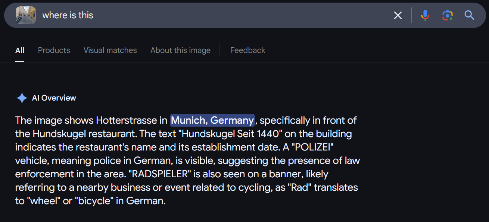
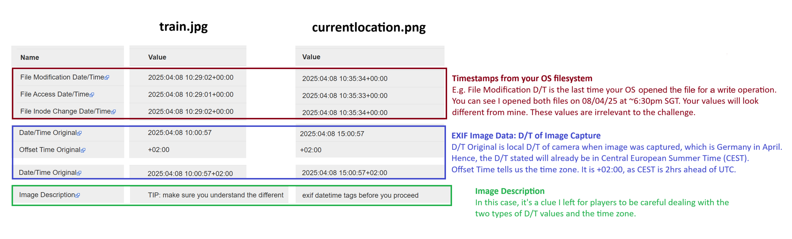
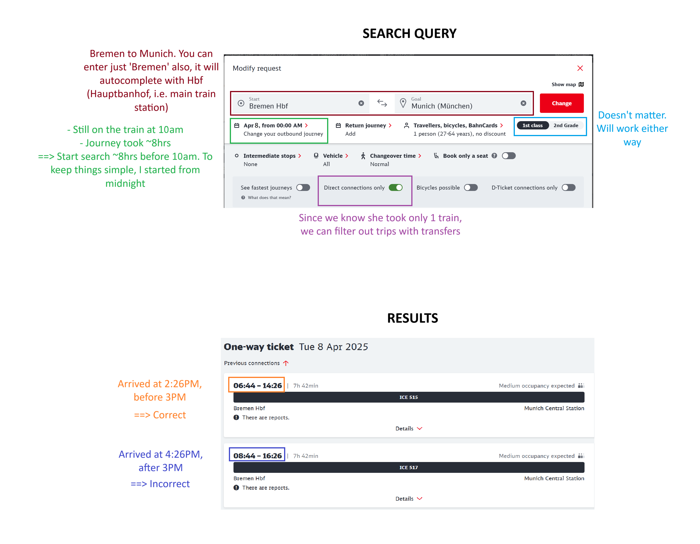
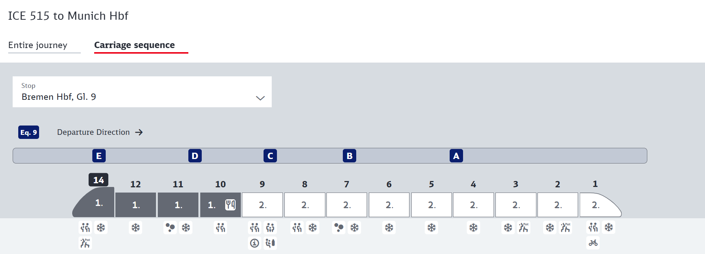
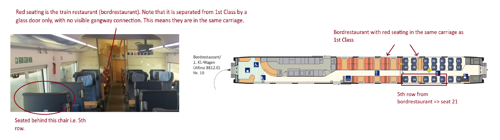

# Solution

The final flag describes a list of information we must find, from the big-picture details (destination/train type) to the minutiae (seat number). This is the ideal solution pathway - step-by-step, finding the big-picture details first then narrowing in on the small details.

We shall employ that solution pathway.

### 1. Current City
**Option 1:** Reverse image search currentlocation.png using Google Lens. It also works with an added text prompt, e.g.

**Option 2:** We don't always need AI. Simply search for the building and street (Hundskugel and Hackenstraße) on any search engine. 

Finally, cross-check your answer by finding the Google Maps [street view location](https://maps.app.goo.gl/36hX3YmYh2g3oRjU9). It is 8 Hackenstraße, Munich.

**Fun fact**: the police car and building have a blue-and-white checkered flag (i.e. the Bavaria flag). Munich is the capital of the German State of Bavaria.

### 2. Train Number
1. email2.png: "the time's probably stored in the pictures" suggests date-time EXIF data is relevant.
2. View metadata of both images, using exiftool (the [browser-based one](https://exif.tools/) will suffice for this challenge). Here is a summary and analysis of relevant results from both images:  Both images were taken on 8 April 2025. train.jpg was taken  at 10am CEST and currentlocation.png was taken at 3pm CEST.
3. In email2.png, she describes travelling for about 8hrs, on 1 singular train from Bremen.
4. Using any transportation booking website (e.g. [trainline](https://www.thetrainline.com/)), realise that direct trains between Bremen and Munich are only operated by Deutsche Bahn (DB).
5. Using the [DB website](https://www.bahn.de/), the only **direct** train between Bremen and Munich on **8 April 2025** that **departed before 10am** and **arrived before 3pm** is ICE 515. The journey lasted 7hr 24min, which is indeed approximately 8hrs.
6. **[Optional]** ICE 515 is the only possible train that fits into the timeline, so this step is not necessary, but note that the timings stated on the DB website are scheduled timings, not [actual timings](https://bahn.expert/details/ICE%20515/j/20250408-108f3d17-8f18-32bd-8175-6d92425bf41d) (*this website localises the timings to your current time zone, so remember to convert them back into CEST). In reality, the train arrived 5 minutes late at 2:31PM CEST. This is still before 3PM.

**Fun fact**: For added realism's sake, it takes 17minutes to walk from the train station (Munich Hauptbanhof) to 8 Hackenstraße, where currentlocation.png was taken. Given the train arrived at ~2:30pm CEST, there's ample time to make the journey and take the photo by 3PM CEST.

### 3. Train Type
**Option 1**: [This website](https://www.grahnert.de/fernbahn/reihung/reih0043.html) which I found via [this reddit post](https://www.reddit.com/r/germany/comments/w9p22c/how_can_i_identify_the_type_of_ice_im_traveling/) catalogues DB trains and their associated type. Train 515 is a ICE 4 train.

**Option 2**: The DB website displays the carriage sequence for ICE 515 (pictured below). It has 13 carriages - 9 2nd Class, 3 1st Class and 1 Restaurant + 1st Class. Comparing that with the [train layout](https://www.seat61.com/trains-and-routes/ice.htm) across all train types, ICE 4 is the only one with this configuration.

**Option AI?**: Reverse image search using Google Lens + Gemini AI. However, it sometimes gives me the wrong answer (ICE 3). When I tried asking Gemini AI "what train type is ICE 515" it also confidently gave me the wrong answer. I would recommend always double-checking answers from AI.

### 4. Seating Class
1. Seats have a 2-1 configuration. Seats are leather with a light blue head cushion that has a '1.' on it. 
2. Using online images or [this 360 tour](https://ecm-mediathek-cdn.deutschebahn.com/cdnecmamination/db121508/445991/animation/index.html) we confirm that, on the ICE 4, these features are only available in 1st class.

### 5. Seat Number
1. Find [ICE 4 train seating plan](https://www.seat61.com/reference/trainseatplans/ICE4.pdf).
2. She is seated in the train carriage that contains both the restaurant and 1st class. That is, carriage #10. Comparing the image with the seating plan, we conclude she is sitting in seat 21.

**Flag: LNC25{munich_515_ice4_1_21}**  

#### Useful Resources
1. ICE seating charts: [https://www.seat61.com/trains-and-routes/ice.htm](https://www.seat61.com/trains-and-routes/ice.htm)
2. DB train # to type conversion: [https://www.grahnert.de/fernbahn/reihung/reih0043.html](https://www.grahnert.de/fernbahn/reihung/reih0043.html)
3. ICE types list: [https://int.bahn.de/en/trains/long-distance-trains](https://int.bahn.de/en/trains/long-distance-trains)
4. EXIF date-time guide: [https://www.publicspace.net/ABetterFinderAttributes/v7/ContentCreationDateDestinations.html](https://www.publicspace.net/ABetterFinderAttributes/v7/ContentCreationDateDestinations.html)

#### Image Source
train.png: [https://www.youtube.com/watch?v=7nUfqlA9yaE](https://www.youtube.com/watch?v=7nUfqlA9yaE)

#### Bonus
There are many other viable ways to solve this. Some may consider finding the train type by comparing the seat design with images of ICE trains online. That will work in this challenge, but in general I would advise against this, because DB sometimes updates their train interiors with newer seats. It's possible to find ICE 1 trains with ICE 4 seats, for example. It is also possible to find ICE 4 trains with ICE 3 neo seats.  

However, in this challenge, I ensured that the ICE 4 train pictured happens to be sporting the original ICE 4 seating that can be seen in promotional material for the train as well as in the 360 tour on the DB website. I didn't want to make this too difficult for players, because (trust me) you have to go down one long rabbit hole to realise the whole seat-retrofitting thing, and it's not well-documented anywhere.

#### Author's Note (Post-CTF)
Participants found this challenge much harder than I anticipated. It was the challenge I received the most tickets for.

This was partially my fault. I believe a lot of teams found the flag description to be quite vague. In particular, they got confused between train number and train type. In hindsight, I should have provided an example in the challenge description.

I think many also found it difficult to distinguish what information in the zip file was pertinent to solving the problem and what was storytelling. I'd written this quite carefully to make sure every piece of information I included aligns with the story and the CTF challenge. I was trying to mimic a real-life stalking scenario, but I think that was lost on many of the participants.