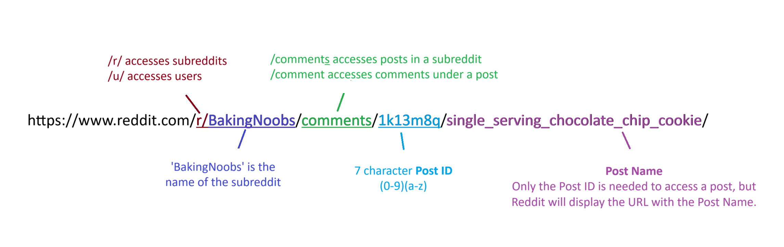
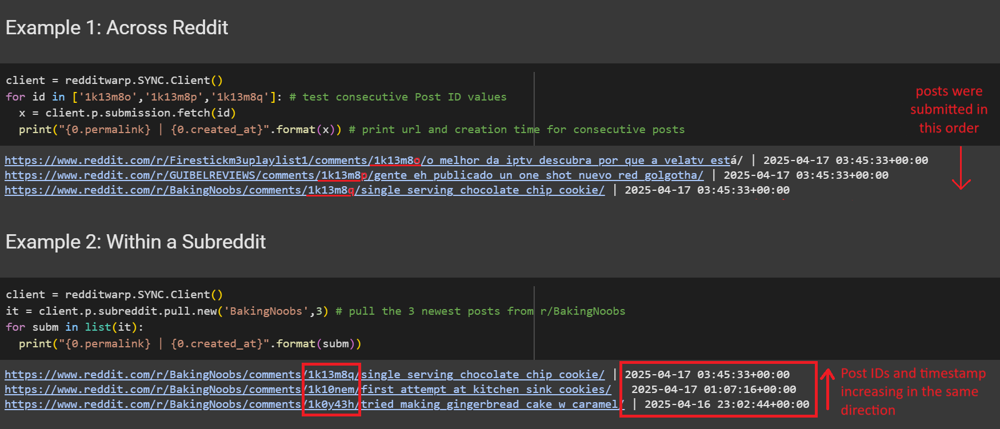

# Solution

We are provided with a partial Reddit link, the rest of which has seemingly burnt off (in a baking incident, we can presume). 
```
https://www.reddit.com/r/bakingrecipes/comments/1jxl...
```
We need to find possible posts that could have this link. It's not impossible to do it manually (by scrolling down r/bakingrecipes and checking every post), but to be more efficient we can use Reddit API.


#### Part 1: Understanding Reddit Links
Reddit is a social media platform that looks and functions similar to a forum. It is comprised of communities called subreddits, which are topic-specific forum pages that users can submit content ('posts') to. Every post has its own URL link.

Here is an example link for a Reddit post.


Another relevant aspect of Reddit links is how the 7-character Post ID value is incremental for consecutive posts across the entire Reddit website. That is, the larger the Post ID value, the more recently the post was submitted.



Example 2 illustrates the same concept within a subreddit.

All posts made within a given period of time will have the same Post ID prefix. In example 2, all 3 posts have the same prefix '1k' but only the first 2 posts have the prefix '1k1', while the 3rd post has the smaller prefix '1k0' because it was made at an earlier time.

In this way, ID prefix functions as a relative timestamp for posts. Posts made before a reference time period will have a smaller ID prefix and posts made after will have a larger ID prefix. We can use this to our advantage.


#### Part 2: Reddit API
You can access Reddit API any way you like. I recommend something like [PRAW](https://github.com/praw-dev/praw) (Python Reddit API Wrapper) or [RedditWarp](https://github.com/Pyprohly/redditwarp). I will be using RedditWarp in this case.

1. On the 'bakingrecipes' subreddit, sort posts by **newest to oldest** (reverse chronological order). Posts will appear in groups, each group is called a 'page'. 
2. We are looking for post(s) whose 7-character Post ID begins with **'1jxl'**. We will define this as our **target prefix**.
3. For every page, if the smallest ID prefix across all posts is larger than the target prefix, all posts on the page are posted **after** our target post. We can skip to the next page.
4. Otherwise, we can look through every post on the page. If it has a matching prefix, it could be our target post.
5. If we encounter a post with a prefix smaller than the target prefix, we know that this post and all posts after it were made **before** our target post. We can end our search.
6. Running the [code](script.py) will result in a list of 2 results. Visit each link and read the post and comments.
```
https://www.reddit.com/r/bakingrecipes/comments/1jxlsto/lemon_cake_for_my_birthday/ | 2025-04-12 16:55:05+00:00
https://www.reddit.com/r/bakingrecipes/comments/1jxlkfn/here_i_am_with_my_chocolate_cake_i_made_from/ | 2025-04-12 16:44:49+00:00
```
7. On the post [Lemon cake for my birthday](https://www.reddit.com/r/bakingrecipes/comments/1jxlsto/lemon_cake_for_my_birthday/), notice there is a comment left from [u/Pr1me_C4ndid8](https://www.reddit.com/user/Pr1me_C4ndid8/). The flag is in Pr1me_C4ndid8's bio.  


**Flag: LNC25{r3dD!7_Api_h45_mY_v073}**  


#### References
RedditWarp Guide: [https://redditwarp.readthedocs.io/en/latest/user-guide](https://redditwarp.readthedocs.io/en/latest/user-guide)
RedditWarp Github: [https://github.com/Pyprohly/redditwarp](https://github.com/Pyprohly/redditwarp)

#### Author's Note (Post-CTF)
Participants came up with other ways to solve this. 

Some people bruteforced all possible 7-character post IDs with the target prefix. Someone got their IP address banned by Reddit for that, so I wouldn't recommend. 

Someone managed to cheese the challenge by searching the incomplete link on the Internet Archives (http://web.archive.org/web/*/https://www.reddit.com/r/bakingrecipes/comments/*), and enter the incomplete link into the filter bar. This makes this challenge infuriatingly simple! I'd never thought of using Internet Archives as a solution for completing incomplete links, so it's a new tool to add to my toolbox!