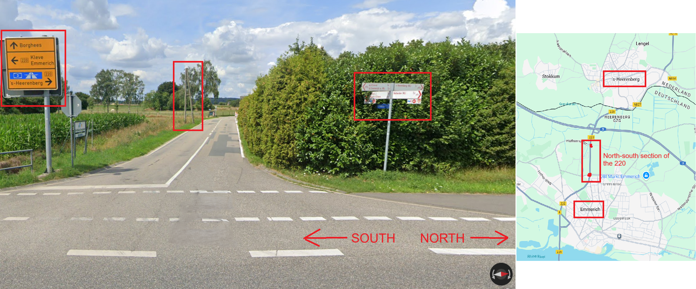

# Solution

This is a geolocation challenge focused on using place names, road infrastructure (e.g. country or region specific utility poles, road lines, signage) and cardinal directions (the compass) to find a location. 

Although pole meta is not necessary to find some of these locations, every location has a visible utility pole and I will mention it regardless.

### 1.png

1. California-specific utility poles are wooden with 3 yellow rings near the bottom. 
2. Intersection between Maverick Lane and E Lemon Heights Drive. A simple Google will find this location.

**COORDS: 33.7609,-117.7775** 
[Maverick Lane, North Tustin, California, USA](https://maps.app.goo.gl/YU7Rahp5HP8NrAaj9)

### 2.png

1. Queensland, Australia often has **diagonal numbering** on its poles and a **circular, usually blue sticker**.
2. From 'The Pool Tile Company', we can assume the name of this company is likely Monsoon Pools. This is easily Google-able.

**COORDS: -26.4127,153.0424** 
[Noosaville, Queensland, Australia](https://maps.app.goo.gl/SqRb473KrLweoZGD8)

### 3.png

1. Concrete poles with step-like indents are found in - but not exclusive to - France
2. Long white license plate with blue strips on the left and right are found in - but not exclusive to - France
3. Mountains in the background are the French Alps
4. French language on the sign
5. Mistral and Eaux Claires are districts in Grenoble. According to the compass, they are **North** of us. 
6. We are on a **north-south road** that intersects an **east-west road**. Using Google Street view, explore roads south of Mistral that apply. You can use the house behind the street sign, with its bright orange accents, to quickly verify/veto locations.

**COORDS: 45.1679,5.7048** 
[Mistral, Grenoble, France](https://maps.app.goo.gl/5scifBTCiy6gR9mv8)

### 4.png

1. There are German and Dutch locations on the yellow road sign. We are near the DE-NL border, but which country are we in?
2. Red-and-white bicycle sign is typical for [North Rhine-Westphalia and southern Lower Saxony](https://images.squarespace-cdn.com/content/v1/60f6054f4e76b03092956de8/6cdbab1b-5b65-40a6-82df-1f8952135097/Germany_bicycle_signs_map.png).
3. There is also a wooden utility pole in the background. The **Netherlands does not usually have utility poles**. We are likely in Germany.
4. Yellow road sign + compass tells us we're on a **north-south** stretch of the **220** between 's-Heerenberg and Emmerich.
5. As indicated by the map, there is only 1 such stretch, and only two points at which an **east-west road** (like the one pictured) intersects the 220. 

**COORDS: 51.8588,6.2415** 
[Emmerich, North-Rhine Westphalia, Germany](https://maps.app.goo.gl/AJsUq23pF41PrxWa8)

### 5.png

1. Portuguese poles: concrete ladder poles, with a **small circular hole** in each segment
2. Portuguese directional sign: white with black text and black arrow
3. The sign suggests we are near a place called Andrães. From Google Maps, we can see it is a very small village. Typically, directional signs to a small village will either be on its border or at the exit of neighboring villages. 
4. Using the compass, we are at an intersection between a **northwest-southeast main road** and a **northeast-facing road** that leads to Andrães.
5. Start by looking along the village border. There are 3 intersections that roughly match the cardinal directions, which I've marked on the map. Look out for the house with its unique stone chimney.

**COORDS:41.2668,-7.6973**
[Andrães, Vila Real, Portugal](https://maps.app.goo.gl/3FpT49iukYxmM1ty7)

**I used coverage from 2022, which looks quite different from 2025, as a patch of trees has been cut down since then. However, the house still looks the same.*

### 6.png

1. 'AAR' on the building refers to AAR Corp, with [many locations](https://www.aarcorp.com/en/about/locations/). Can we narrow them down?
2. **Canada**: Canadian flag on airplane wing, 'Maximum' and 'km/h' on speed limit sign (as opposed to 'Speed Limit' and 'mph' used in USA)
3. **Quebec**: [red-and-white traffic cones](https://images.squarespace-cdn.com/content/v1/60f6054f4e76b03092956de8/8d6d4eb7-ef05-4801-929c-56b1544e93c8/traffic-cones2+extra+whitespace.png), black-and-yellow utility pole label, ‘Arrêt’ stop sign and usage of French
4. There is only 1 AAR location in Canada/Quebec, in the Trois-Rivières airport. Using the compass, we are on a road headed southwest towards the AAR building. 

**COORDS:46.3603,-72.6784**
[Aéroport de Trois-Rivières, Quebec, Canada](https://maps.app.goo.gl/maNhjHBEVUNpARo57)

### 7.png

1. EU license plate: long and white, with a blue strip on the left. 
2. There are two utility poles visible. One has a **harp-shaped pole-top**, unique to Greece. The other has 5 vertical insulators, common in Greece.
3. Search for 'Scissor Hands' in Greece, using any search engine or Google Maps. It is a barbershop.

**COORDS:37.9996,23.6840**
[Egaleo, Greece](https://maps.app.goo.gl/ebEEErcV2JPtgv3v7)

### 8.png

1. Most common **Brazilian utility pole**: rectangular, ladder-style and painted white at the bottom.
2. Citolab is a Brazilian medical diagnostics company, with locations all over the country. Sadly, they are not well-documented, as it seems every state manages its Citolab stores separately.
3. [(68) phone/area code](https://images.squarespace-cdn.com/content/v1/60f6054f4e76b03092956de8/930c8141-7d6e-4397-a56c-f58b902e85c1/Brasil_-_C%C3%B3digos_de_%C3%A1rea_DDD.png) is for the Brazilian state of Acre.
4. Using Google Maps, search for "Citolab" over the area of Acre. Google Maps is a little finnicky here, and often redirects you to the Citolab in Cruzeiro do Sul. You'll have to try different inputs: "citolabs in acre brazil", "Citolab in Acre where" or "citolab in acre?" usually work for me. It will generate a list of locations that you can then investigate on street view.

**COORDS:-7.7356,-72.6514**
[Rodrigues Alves, Acre, Brazil](https://maps.app.goo.gl/DN3uuR45bD6XVX7D8)

### 9.png

1. **Japan**: Japanese text on the building. [Uobei](https://www.uobei.info/), the restaurant, is a dining concept by Genki Global that operates in Japan and USA, but this architecture looks more Japanese.
2. **Kansai**: the utility pole features a transformer mounted on the **side of a square**, with a zigzag bar extending from the **bottom** of that square. These are [unique to the Kansai region of Japan](https://www.plonkit.net/japan#2).
3. Uobei has a total of 178 outlets in Japan, but we can now narrow this down to the **26** in Kansai (in Hyogo, Osaka, Kyoto and Mie prefectures). 
4. Using their incredibly [user-friendly website](https://www.uobei.info/store/) (not sarcasm), open every Kansai outlet in Google Maps street view. To confirm the location, ensure the building has an east-facing facade, with a red-and-white structure behind it.

**COORDS:34.8388,135.4207**
[Kawanishi, Hyogo Prefecture, Japan](
https://maps.app.goo.gl/1beCH474YRFUVx7C9)

**The red-and-white structure is the telecomms tower/antenna for NTT West Kawanishi Building!*

### 10.png

1. [Left-hand drive](https://en.wikipedia.org/wiki/Left-_and_right-hand_traffic#/media/File:Countries_driving_on_the_left_or_right.svg) eliminates most of the Americas and Europe.
2. [Single yellow outer road lines](https://geomastery.com/markings/) makes Australia extremely unlikely, and turns our focus to southern African countries.
3. If you look at utility poles across these countries, you will find that only South Africa has this **A-shape pole top**, specifically [in Western Cape](https://www.plonkit.net/south-africa#2).
4. There are [34 total wind farms in South Africa](https://mybroadband.co.za/news/energy/508804-all-34-wind-farms-providing-power-to-south-africa.html), which we can now narrow down to the **7** in Western Cape.
5. Using the compass, we know we're searching for a **northwest-facing road** that has a **westward bend** up ahead, with the wind farm to the **northeast**.

**COORDS:-33.2773,19.0260**
[Gouda Wind Farm, Western Cape, South Africa](https://maps.app.goo.gl/rcrXawSoVXgem9Jg6)

### Resources
- [Plonkit](www.plonkit.net)

### Trivia
All locations are themed off the video game Metal Gear Rising: Revengeance. Here are the character references, for those curious:
1. Maverick Lane - Maverick Security Consulting, Inc.
2. Monsoon Pools - Monsoon 
3. Mistral, France - Mistral
4. Emmerich, Germany - Sunny Emmerich
5. Andrães, Portugal - Andrey Dolzaev
6. Aéroport de Trois-Rivières - Solis Space & Aeronautics
7. Scissor Hands Barbershop - Sundowner (His combat weapon is a pair of machete blades that can transform into a scissors-like contraption)
8. Rodrigues Alves, Brazil - Sam Rodrigues
9. Kawanishi, Japan - Hideo Kojima (MGRR's creator) lived here
10. Gouda Wind Farm - Winds of Destruction

### Author's Note (Post-CTF)
This challenge was solved by many more teams that I expected. I overlooked the fact that a lot of teams would employ bruteforce techniques on the service, instead of actually trying to find the locations on Google Maps. If I make a similar challenge in the future, I would have to add some sort of PoW calculation or time delay to the service in order to discourage bruteforce guessing.

A lot of participants also complained about how tedious this challenge was, and some also remarked that it was too simple. Admittedly, I went rather easy on them as I wasn't sure how much Geo-OSINT experience the pool of participants would have. If I write for this CTF again, I'd do fewer locations but make all of them much harder.